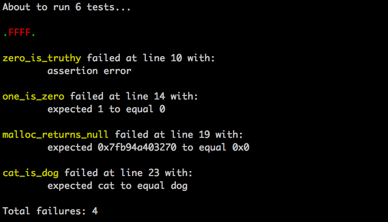

## What?

A tiny C testing library, inspired by [these](https://github.com/siu/minunit)
[versions](http://www.jera.com/techinfo/jtns/jtn002.html) of MinUnit.

## Why?

Partially to write some tests, mostly to learn how to (ab)use macros.

## How?

The following code:

```c
#include <stdlib.h>
#include "c_utest.h"

void one_is_one_and_not_two() {
  ASSERT_EQUAL_INTS(1, 1);
  ASSERT_DIFFN_INTS(1, 0);
}

void zero_is_truthy() {
  ASSERT(0);
}

void one_is_zero() {
  ASSERT_EQUAL_INTS(1, 0);
}

void malloc_returns_null() {
  char* a = malloc(sizeof(char));
  ASSERT_EQUAL_PTRS(a, NULL);
}

void cat_is_dog() {
  ASSERT_EQUAL_STRS("cat", "dog");
}

void actually_cat_is_cat_not_dog() {
  ASSERT_EQUAL_STRS("cat", "cat");
  ASSERT_DIFFN_STRS("cat", "dog");
}

int main(void) {
  TEST_THAT(one_is_one_and_not_two);
  TEST_THAT(zero_is_truthy);
  TEST_THAT(one_is_zero);
  TEST_THAT(malloc_returns_null);
  TEST_THAT(cat_is_dog);
  TEST_THAT(actually_cat_is_cat_not_dog);
  RUN_TESTS();
}
```

If you check it out and run:

```bash
gcc example.c && ./a.out
```

Should produce the following output:


